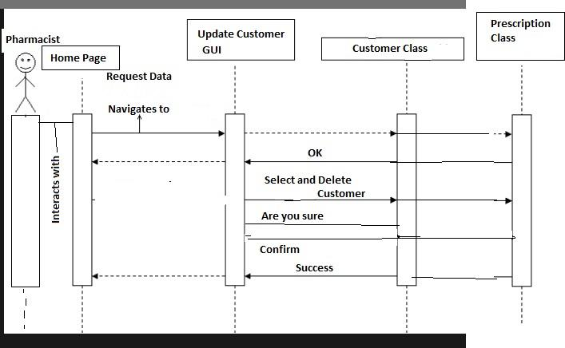

# **Pharmacy Software**

# **Documentation**

Lucas Weber

Adam Calkins

Valerie Crissy

Christopher Grabski

Anthony Whiteman

[[TOC]]

# Use Cases

The only person that would interact with our program is the pharmacist. They would use this program to add new customers , display  current customers and from  there   update or delete  customers.

# Sequence Diagrams

## Add  New Customer Sequence Diagram

## View All Customers Sequence Diagram

## Update/Delete Customer Sequences

# 

# 

# Graphical User Interfaces 

## Main GUI

## 

## Enter Customer GUI

## 

**View All Customers**

# GUI Code

## Enter New Customer GUI

package PharmacyProgram;

	//This GUI interpets the data from the text fields and enters them into

	// the appropriate classes. Creates two new objects: aCustomer and

	//aPrescriptionHistory. These would be stored in a database.

public class EnterCustomer extends javax.swing.JFrame {

	//Create a customer and prescription history to be filled later.

 Customer aCustomer = new Customer();

 PrescriptionHistory aPrescriptionHistory = new PrescriptionHistory();

 

	public EnterCustomer() {

  	 

    	initComponents();

	}

	@SuppressWarnings("unchecked")

    	[Generated Code]

    

	private void jButton1ActionPerformed(java.awt.event.ActionEvent evt) {                                    	 

  	 

    	//Sets properties of Customer() and PrescriptionHistory() based

    	//on the information in the text boxes.

   	 

    	aCustomer.setFirstName(firstName.getText());

    	aCustomer.setLastName(lastName.getText());

    	aCustomer.setTelephone(telephone.getText());

    	aCustomer.setDateOfBirth(dateOfBirth.getText());

    	aCustomer.setInsuranceProvider(insuranceProvider.getText());

    	aCustomer.setInsurancePolicyNumber(Integer.parseInt(policyNumber.getText()));

    	aPrescriptionHistory.setCustomerFirstName(firstName.getText());

    	aPrescriptionHistory.setCustomerLastName(lastName.getText());

    	aPrescriptionHistory.setPrescriptionName(prescriptionName.getText());

    	aPrescriptionHistory.setPhysicianName(physician.getText());

    	aPrescriptionHistory.setPhysicianPhone(physicianPhoneNumber.getText());

    	aPrescriptionHistory.setDateIssued(dateIssued.getText());

    	aPrescriptionHistory.setExpirationDate(expirationDate.getText());

    	aPrescriptionHistory.setNumberOfRefills(Integer.parseInt(numberOfRefills.getText()));

    	aPrescriptionHistory.setDosesPerRefill(dosesPerRefill.getText());

    	boolean aGenericSubstitute;

   	 

    	if (btnTrue.isSelected()){

       	 

        	aPrescriptionHistory.setGenericSubstitute(Boolean.getBoolean(btnTrue.getName()));

       	 

    	}

    	else {

       	 

        	aPrescriptionHistory.setGenericSubstitute(Boolean.getBoolean(btnFalse.getName()));

    	}

   	 

    	System.out.println(aCustomer.toString());

    	System.out.println(aPrescriptionHistory.toString());

	}                                   	 

	public static void main(String args[]) {

    	/* Set the Nimbus look and feel */

    	//<editor-fold defaultstate="collapsed" desc=" Look and feel setting code (optional) ">

    	/* If Nimbus (introduced in Java SE 6) is not available, stay with the default look and feel.

     	* For details see http://download.oracle.com/javase/tutorial/uiswing/lookandfeel/plaf.html

     	*/

    	try {

        	for (javax.swing.UIManager.LookAndFeelInfo info : javax.swing.UIManager.getInstalledLookAndFeels()) {

            	if ("Nimbus".equals(info.getName())) {

                	javax.swing.UIManager.setLookAndFeel(info.getClassName());

                	break;

            	}

        	}

    	} catch (ClassNotFoundException ex) {

        	java.util.logging.Logger.getLogger(EnterCustomer.class.getName()).log(java.util.logging.Level.

SEVERE, null, ex);

    	} catch (InstantiationException ex) {

        	java.util.logging.Logger.getLogger(EnterCustomer.class.getName()).log(java.util.logging.Level.

SEVERE, null, ex);

    	} catch (IllegalAccessException ex) {

        	java.util.logging.Logger.getLogger(EnterCustomer.class.getName()).log(java.util.logging.Level.

SEVERE, null, ex);

    	} catch (javax.swing.UnsupportedLookAndFeelException ex) {

        	java.util.logging.Logger.getLogger(EnterCustomer.class.getName()).log(java.util.logging.Level.

SEVERE, null, ex);

    	}

    	//</editor-fold>

    

    

    

    

    	/* Create and display the form */

    	java.awt.EventQueue.invokeLater(new Runnable() {

        	public void run() {

            	new EnterCustomer().setVisible(true);

        	}

    	});

	}

	// Variables declaration - do not modify                	 

	private javax.swing.JRadioButton btnFalse;

	private javax.swing.JRadioButton btnTrue;

	private javax.swing.ButtonGroup buttonGroup1;

	private javax.swing.ButtonGroup buttonGroup2;

	private javax.swing.ButtonGroup buttonGroup3;

	private javax.swing.ButtonGroup buttonGroup4;

	private javax.swing.ButtonGroup buttonGroup5;

	private javax.swing.JTextField dateIssued;

	private javax.swing.JTextField dateOfBirth;

	private javax.swing.JTextField dosesPerRefill;

	private javax.swing.JTextField expirationDate;

	private javax.swing.JTextField firstName;

	private javax.swing.JTextField insuranceProvider;

	private javax.swing.JButton jButton1;

	private javax.swing.JLabel jLabel1;

	private javax.swing.JLabel jLabel10;

	private javax.swing.JLabel jLabel11;

	private javax.swing.JLabel jLabel12;

	private javax.swing.JLabel jLabel13;

	private javax.swing.JLabel jLabel14;

	private javax.swing.JLabel jLabel15;

	private javax.swing.JLabel jLabel2;

	private javax.swing.JLabel jLabel3;

	private javax.swing.JLabel jLabel4;

	private javax.swing.JLabel jLabel5;

	private javax.swing.JLabel jLabel6;

	private javax.swing.JLabel jLabel7;

	private javax.swing.JLabel jLabel8;

	private javax.swing.JLabel jLabel9;

	private javax.swing.JTextField lastName;

	private javax.swing.JTextField numberOfRefills;

	private javax.swing.JTextField physician;

	private javax.swing.JTextField physicianPhoneNumber;

	private javax.swing.JTextField policyNumber;

	private javax.swing.JTextField prescriptionName;

	private javax.swing.JTextField telephone;

	// End of variables declaration              	 

}

## View All Customers

public class ViewAllCustomers extends javax.swing.JFrame {

    private static final long serialVersionUID = 1L;

	public ViewAllCustomers() {

    	initComponents();

	}

	/**

 	* This method is called from within the constructor to initialize the form.

 	* WARNING: Do NOT modify this code. The content of this method is always

 	* regenerated by the Form Editor.

 	*/

	@SuppressWarnings("unchecked")

	// <editor-fold defaultstate="collapsed" desc="Generated Code">                     	 

	private void initComponents() {

    	jScrollPane1 = new javax.swing.JScrollPane();

    	jList1 = new javax.swing.JList();

    	jLabel1 = new javax.swing.JLabel();

    	jButton1 = new javax.swing.JButton();

    	setDefaultCloseOperation(javax.swing.WindowConstants.EXIT_ON_CLOSE);

    	//Display the basic information about each customer

    	jList1.setModel(new javax.swing.AbstractListModel() {

   		 

   		 private static final long serialVersionUID = 1L;

   		 String[] customerList = {"1" + " " + "Christopher" + " " + "Grabski", "2" + " " + "Lucas" + " " + "Weber" };

        	public int getSize() {

       		 return customerList.length; }

        	public Object getElementAt(int i) {

       		 return customerList[i]; }

    	});

    	jScrollPane1.setViewportView(jList1);

    	jLabel1.setText("View All Customers:");

    	jButton1.setText("Back");

    	jButton1.addActionListener(new java.awt.event.ActionListener() {

        	public void actionPerformed(java.awt.event.ActionEvent evt) {

            	jButton1ActionPerformed(evt);

        	}

    	});   

    	javax.swing.GroupLayout layout = new javax.swing.GroupLayout(getContentPane());

    	getContentPane().setLayout(layout);

    	layout.setHorizontalGroup(

        	layout.createParallelGroup(javax.swing.GroupLayout.Alignment.LEADING)

        	.addGroup(layout.createSequentialGroup()

            	.addGroup(layout.createParallelGroup(javax.swing.GroupLayout.Alignment.LEADING)

                	.addGroup(layout.createSequentialGroup()

                    	.addGap(122, 122, 122)

                    	.addGroup(layout.createParallelGroup(javax.swing.GroupLayout.Alignment.LEADING)

                        	.addComponent(jLabel1)

                        	.addComponent(jScrollPane1, javax.swing.GroupLayout.PREFERRED_SIZE, 165, javax.swing.GroupLayout.PREFERRED_SIZE)))

                	.addGroup(layout.createSequentialGroup()

                    	.addGap(168, 168, 168)

                    	.addComponent(jButton1)))

            	.addContainerGap(134, Short.MAX_VALUE))

    	);

    	layout.setVerticalGroup(

        	layout.createParallelGroup(javax.swing.GroupLayout.Alignment.LEADING)

        	.addGroup(javax.swing.GroupLayout.Alignment.TRAILING, layout.createSequentialGroup()

            	.addContainerGap(javax.swing.GroupLayout.DEFAULT_SIZE, Short.MAX_VALUE)

            	.addComponent(jLabel1)

            	.addGap(15, 15, 15)

            	.addComponent(jScrollPane1, javax.swing.GroupLayout.PREFERRED_SIZE, javax.swing.GroupLayout.DEFAULT_SIZE, javax.swing.GroupLayout.PREFERRED_SIZE)

            	.addGap(28, 28, 28)

            	.addComponent(jButton1)

            	.addGap(24, 24, 24))

    	);

    	pack();

	}// </editor-fold>                   	 

	private void jButton1ActionPerformed(java.awt.event.ActionEvent evt) {                                    	 

    	// TODO add your handling code here:

	}                                   	 

	/**

 	* @param args the command line arguments

 	*/

	public static void main(String args[]) {

    	/* Set the Nimbus look and feel */

    	//<editor-fold defaultstate="collapsed" desc=" Look and feel setting code (optional) ">

    	/* If Nimbus (introduced in Java SE 6) is not available, stay with the default look and feel.

     	* For details see http://download.oracle.com/javase/tutorial/uiswing/lookandfeel/plaf.html

     	*/

    	try {

        	for (javax.swing.UIManager.LookAndFeelInfo info : javax.swing.UIManager.getInstalledLookAndFeels()) {

            	if ("Nimbus".equals(info.getName())) {

                	javax.swing.UIManager.setLookAndFeel(info.getClassName());

                	break;

            	}

        	}

    	} catch (ClassNotFoundException ex) {

        	java.util.logging.Logger.getLogger(ViewAllCustomers.class.getName()).log(java.util.logging.Level.SEVERE, null, ex);

    	} catch (InstantiationException ex) {

        	java.util.logging.Logger.getLogger(ViewAllCustomers.class.getName()).log(java.util.logging.Level.SEVERE, null, ex);

    	} catch (IllegalAccessException ex) {

        	java.util.logging.Logger.getLogger(ViewAllCustomers.class.getName()).log(java.util.logging.Level.SEVERE, null, ex);

    	} catch (javax.swing.UnsupportedLookAndFeelException ex) {

        	java.util.logging.Logger.getLogger(ViewAllCustomers.class.getName()).log(java.util.logging.Level.SEVERE, null, ex);

    	}

    	//</editor-fold>

    	/* Create and display the form */

    	java.awt.EventQueue.invokeLater(new Runnable() {

        	public void run() {

            	new ViewAllCustomers().setVisible(true);

        	}

    	});

	}

	// Variables declaration - do not modify                	 

	private javax.swing.JButton jButton1;

	private javax.swing.JLabel jLabel1;

	private javax.swing.JList jList1;

	private javax.swing.JScrollPane jScrollPane1;

	// End of variables declaration              	 

}

# Classes

## Customer Class

<table>
  <tr>
    <td></td>
    <td></td>
  </tr>
  <tr>
    <td>//This class contains information on individual customers.</td>
    <td></td>
  </tr>
</table>

public class Customer {

    

//These will be the major variables used in this class

//Here we set the default values to each variable according to each variable's type.

    private int customerId = -1;

    private String firstName = "N/A";

    private String lastName = "N/A";

    private String telephone = "N/A";

    private String dateOfBirth = "N/A";

    private String insuranceProvider = "N/A";

    private int insurancePolicyNumber = 00000;

    

    //This section of code deals with "gets and sets"

    //Gets return the particular variable we request, allowing the user to read selected data.

    public int getCustomerId(){

   	 return customerId;

    }

    //Sets allow users to write new data.

    //Without a "set", and only a "get", the data would be read-only.

    public void setCustomerId(int aCustomerId){

   	 this.customerId = aCustomerId;

    }

    

    

    public String getFirstName(){

   	 return firstName;

    }

    public void setFirstName(String aFirstName){

   	 this.firstName = aFirstName;

    }

    

    

    public String getLastName(){

   	 return lastName;

    }

    public void setLastName(String aLastName){

   	 this.lastName = aLastName;

    }

    

    

    

    public String getTelephone(){

   	 return telephone;

    }

    public void setTelephone(String aTelephone){

   	 this.telephone = aTelephone;

    }

    

    

    

    public String getDateOfBirth(){

   	 return dateOfBirth;

    }

    public void setDateOfBirth(String aDateOfBirth){

   	 this.dateOfBirth = aDateOfBirth;

    }

    

    

    public String getInsuranceProvider(){

   	 return insuranceProvider;

    }

    public void setInsuranceProvider(String aInsuranceProvider){

   	 this.insuranceProvider = aInsuranceProvider;

    }

    

    

    

    public int getInsurancePolicyNumber(){

   	 return insurancePolicyNumber;

    }

    public void setInsurancePolicyNumber(int anInsurancePolicyNumber){

   	 this.insurancePolicyNumber = anInsurancePolicyNumber;

    }

    //End of the get/set section

    

    //This is the default constructor.

    //When we do not create our own constructor, Java will automatically create a default constructor.

    //However, since we made our own constructor, it replaces the default. Therefore, we need to

    //specifically code a default constructor in order to run the program.

public Customer() {}

    

public Customer(int aCustomerId, String aLastName, String aFirstName, String aTelephone,

String aDateOfBirth, String anInsuranceProvider, int anInsurancePolicyNumber) {

   	 this();

   	 this.setCustomerId(aCustomerId);

   	 this.setLastName(aLastName);

   	 this.setFirstName(aFirstName);

   	 this.setTelephone(aTelephone);

   	 this.setDateOfBirth(aDateOfBirth);

   	 this.setInsuranceProvider(anInsuranceProvider);

   	 this.setInsurancePolicyNumber(anInsurancePolicyNumber);

    }

    

    //Constructors for incomplete data.

    //These allow the program to run effectively even if some information is missing from the input.

    //The values that are missing are given a default value such as N/A or 00000 to indicate that they have not received a value.

public Customer(int aCustomerId, String aLastName, String aFirstName, String aTelephone,

String aDateOfBirth, String anInsuranceProvider){

   	 this(aCustomerId,aLastName,aFirstName,aTelephone,aDateOfBirth,anInsuranceProvider,00000);

    }

    

public Customer(int aCustomerId, String aLastName, String aFirstName, String aTelephone,

String aDateOfBirth){

   	 this(aCustomerId,aLastName,aFirstName,aTelephone,aDateOfBirth,"N/A",00000);

    }

    

    public Customer(int aCustomerId, String aLastName, String aFirstName, String aTelephone){

   	 this(aCustomerId,aLastName,aFirstName,aTelephone,"N/A","N/A",00000);

    }

    

    public Customer(int aCustomerId, String aLastName, String aFirstName){

   	 this(aCustomerId,aLastName,aFirstName,"N/A","N/A","N/A",00000);

    }

    

    public Customer(int aCustomerId, String aLastName){

   	 this(aCustomerId,aLastName,"N/A","N/A","N/A","N/A",00000);

    }

    

    public Customer(int aCustomerId){

   	 this(aCustomerId,"N/A","N/A","N/A","N/A","N/A",00000);

    }

    //End of constructor section

    

    

    //Lets print out the values of each variable.

    public String toString(){

   	 

   	 String aString = "";

   	 aString += "Customer ID: " + this.getCustomerId() + "\n";

   	 aString += aString + "Last Name: " + this.getLastName() + "\n";

   	 aString += aString + "First name: " + this.getFirstName() + "\n";

   	 aString += aString + "Telephone: " + this.getTelephone() + "\n";

   	 aString += aString + "Date of Birth: " + this.getDateOfBirth() + "\n";

   	 aString += aString + "Insurance Provider: " + this.getInsuranceProvider() + "\n";

   	 aString += aString + "Insurance Policy Number: " + this.getInsurancePolicyNumber() + "\n";

   	 return aString;

   	 

    }//toString() close

} //Customer() close

    

    

    

##  

## Medication Class

//This class dictates the properties associated with a medication that the

//pharmacy would carry.

public class Medication {

//These will be the major variables used in this class

//Here we set the default values to each variable according to each variable's type.

private String prescription = "NA";

private String genericName = "NA";

private double doses = 0.0;

private String sideEffects = "NA";

private boolean genericAvailable = false;

//This section of code deals with "gets and sets"

//Gets return the particular variable we request, allowing the user to read selected data.

public String getPrescription() {

return prescription;

}

public void setPrescription(String aPrescription) {

this.prescription = aPrescription;

}

public String getGenericName() {

return genericName;

}

public void setGenericName(String aGenericName) {

this.genericName = aGenericName;

}

public double getDoses() {

return doses;

}

public void setDoses(double aDoses) {

this.doses = aDoses;

}

public String getSideEffects() {

return sideEffects;

}

public void setSideEffects(String asideEffects) {

this.sideEffects = aSideEffects;

}

public boolean getGenericAvailable() {

return genericAvailable;

}

public void setGenericAvailable(boolean aGenericAvailable) {

this.genericAvailable = aGenericAvailable;

}

//This is the default constructor.

//When we do not create our own constructor, Java will automatically create a default //constructor.

//However, since we made our own constructor, it replaces the default. Therefore, we need to

//specifically code a default constructor in order to run the program.

public Medication() {}

public Medication(String aPrescription, String aGenericName, double aDoses, 

boolean aGenericAvailable) {

this();

this.prescription = aPrescription;

this.genericName = aGenericName;

this.doses = aDoses;

this.sideEffects = aSideEffects;

this.genericAvailable = aGenericAvailable;

}

public Medication(String aPrescription, String aGenericName, double aDoses, 

String aSideEffects) {

this(aPrescription, aGenericName, aDoses, aSide Effects, false);

}

public Medication(String aPrescription, String aGenericName, double aDoses) {

this(aPrescription, aGenericName, aDoses, "N/A", false);

}

public Medication(String aPrescription, String aGenericName) {

this(aPrescription, aGenericName, 0.0, "N/A", false);

}

public Medication(String aPrescription) {

this(aPrescription, "N/A", 0.0, "N/A", false);

}

public String toString(){

            String aString = "";

            aString = aString + "Prescription: " + this.getPrescription() + "\n";

            aString = aString + "Generic Available: " + this.getGenericAvailable() + "/n";

            aString = aString + "Generic Name" + this.getGenericName() + "\n";

            aString = aString + "Doses" + this.getDoses() + "\n";

	aString = aString + "Side Effects" + this.getSideEffects() + “\n”;

            return aString;

                            	

}

}

## Prescription History Class

//This class contains information on the prescription history of

//a specific customer. These would coincide with a customer.

public class PrescriptionHistory {

    

//major properties

private int prescriptionId = -1;

private String customerFirstName = "N/A";

private String customerLastName = "N/A";

private String prescriptionName = "N/A";

private String physicianName = "N/A";

private String physicianPhone = "N/A";

private String dateIssued = "N/A";

private String expirationDate = "N/A";

private int numberOfRefills = -1;

private String dosesPerRefill = "N/A";

private int refillsGiven = -1;

private String sideEffects = "N/A";

private boolean genericSubstitute = false;

//gets and sets

public void setPrescriptionId(int aPrescriptionId) {

this.prescriptionId = aPrescriptionId;

    }

public void setCustomerFirstName(String aCustomerFirstName) {

    		this.customerFirstName = aCustomerFirstName;

    }

public void setCustomerLastName(String aCustomerLastName) {

    		this.customerLastName = aCustomerLastName;

    }

public void setPrescriptionName(String aPrescriptionName) {

    		this.prescriptionName = aPrescriptionName;

    }

public void setPhysicianName(String aPhysicianName) {

    		this.physicianName = aPhysicianName;

    }

    

public void setPhysicianPhone(String aPhysicianPhone) {

    		this.physicianPhone = aPhysicianPhone;

    }

    

public void setDateIssued(String aDateIssued) {

   		this.dateIssued = aDateIssued;

    }

    

public void setExpirationDate(String aExpirationDate) {

    		this.expirationDate = aExpirationDate;

    }

    

public void setNumberOfRefills(int aNumberOfRefills) {

    		this.numberOfRefills = aNumberOfRefills;

    }

    

public void setDosesPerRefill(String aDosesPerRefill) {

    		this.dosesPerRefill = aDosesPerRefill;

    }

public void setRefillsGiven(int aRefillsGiven) {

    		this.RefillsGiven = aRefillsGiven;

    }

    

public void setGenericSubstitute(boolean aGenericSubstitute) {

    		this.genericSubstitute = aGenericSubstitute;

    }

public int getPresciptionId() {

    		return this.prescriptionId;

}

public String getCustomerFirstName() {

    		return this.customerFirstName;

}

public String getCustomerLastName() {

    		return this.customerLastName;

}

public String getPrescriptionName() {

    		return this.prescriptionName;

}

public String getPhysicianName() {

    		return this.physicianName;

}

public String getPhysicianPhone() {

    		return this.physicianPhone;

}

public String getDateIssued() {

    		return this.dateIssued;

}

public String getExpirationDate() {

    		return this.expirationDate;

}

public int getNumberOfRefills() {

    		return this.numberOfRefills;

}

public String getDosesPerRefill() {

    		return this.dosesPerRefill;

}

public int getRefillsgiven() {

    		return this.RefillsGiven;

}

public String getSideEffects() {

    		return this.sideEffects;

}

public boolean getGenericSubstitute() {

    		return this.genericSubstitute;

}

//constructors

public PrescriptionHistory() {

}

public PrescriptionHistory(String aCustomerFirstName, String aCustomerLastName, 

String aPrescriptionName, String aPhysicianName, 

String aPhysicianPhone, String aDateIssued, String aExpirationDate, 

int aNumberOfRefills, String aNumberOfDoses, String aSideEffects, boolean aGenericSubstitute) {

    	this();

   	this.setCustomerFirstName(aCustomerFirstName);

    	this.setCustomerLastName(aCustomerLastName);

   	this.setPrescriptionName(aPrescriptionName);

    	this.setPhysicianName(aPhysicianName);

    	this.setPhysicianPhone(aPhysicianPhone);

    	this.setDateIssued(aDateIssued);

    	this.setExpirationDate(aExpirationDate);

    	this.setNumberOfRefills(aNumberOfRefills);

    	this.setDosesPerRefill(aNumberOfDoses);

	this.setSideEffects(aSideEffects);

    	this.setGenericSubstitute(aGenericSubstitute);

}

public PrescriptionHistory(int aPrescriptionId, String aCustomerFirstName, 

String aCustomerLastName, String aPrescriptionName, 

String aPhysicianName, String aPhysicianPhone, String aDateIssued, String aExpirationDate, int aNumberOfRefills, String aNumberOfDoses, String aSideEffects, boolean aGenericSubstitute) {

    	this();

    	this.setPrescriptionId(aPrescriptionId);

    	this.setCustomerFirstName(aCustomerFirstName);

   	this.setCustomerLastName(aCustomerLastName);

   	this.setPrescriptionName(aPrescriptionName);

    	this.setPhysicianName(aPhysicianName);

    	this.setPhysicianPhone(aPhysicianPhone);

    	this.setDateIssued(aDateIssued);

    	this.setExpirationDate(aExpirationDate);

    	this.setNumberOfRefills(aNumberOfRefills);

    	this.setDosesPerRefill(aNumberOfDoses);

	this.setSideEffects(aSideEffects);

    	this.setGenericSubstitute(aGenericSubstitute);

}

public String toString(){

String aString = "";

aString = aString + "PrescriptionID = " + this.getPresciptionId() + "\n";

aString = aString + "First Name = " + this.getCustomerFirstName() + "\n";

aString = aString + "Last Name = " + this.getCustomerLastName() + "\n";

aString = aString + "Prescription Name = " + this.getPrescriptionName() + "\n";

aString = aString + "Physician Name = " + this.getPhysicianName() + "\n";

aString = aString + "PhysicianPhone = " + this.getPhysicianPhone() + "\n";

aString = aString + "Date Issued = " + this.getDateIssued() + "\n";

aString = aString + "Expiration Date = " + this.getExpirationDate() + "\n";

aString = aString + "Number of Refills = " + this.getNumberOfRefills() + "\n";

aString = aString + "Number of Doses = " + this.getDosesPerRefill() + "\n";

aString = aString + "Side Effects = “ + this.getSideEffects() + “\n";

aString = aString + "Generic Substitute = " + this.getGenericSubstitute() + "\n"

return aString;

}

}

## Customer Controller

// import the ArrayList

import java.io.IOException;

import java.util.*;

public class CustomerController{

   	 public static void main(String[] args) {

   			ArrayList <Customer> customers = new ArrayList <Customer> ();

   			ConsoleView aView = new ConsoleView();

   		 try{

   			 DataFileLoader aFileLoader = new DataFileLoader();

   			 customers = aFileLoader.getCustomers();

   			 for (Customer Shaniqua: customers) {

   				   aView.print(Shaniqua.toString());

   			 }

   		 }

   		 catch (IOException ex) {

   			 System.out.println("The file would not open");

   		 }

   		 catch (Exception ex) {

   			 System.out.println("Something else crashed");

   		 }

   		 finally {

			//Close the connection

   		 }//finally

   	 } //main()

} // CategoriesRead

 

## Console View

//This Section declares variables and Instantiates them

public class Medication {

private String prescription = "NA";

private String genericName = "NA";

private double doses = 0.0;

private boolean genericAvailable = false;

//get Prescription - allows users to read prescription data

public String getPrescription() {

return prescription;

}

//set Prescription - allows users to write prescription data

public void setPrescription(String aPrescription) {

this.prescription = aPrescription;

}

public String getGenericName() {

return genericName;

}

public void setGenericName(String aGenericName) {

this.genericName = aGenericName;

}

public double getDoses() {

return doses;

}

public void setDoses(double aDoses) {

this.doses = aDoses;

}

public boolean getGenericAvailable() {

return genericAvailable;

}

public void setGenericAvailable(boolean aGenericAvailable) {

this.genericAvailable = aGenericAvailable;

}

//blank constructor

public Medication() {}

public Medication(String aPrescription, String aGenericName, double aDoses, boolean aGenericAvailable) {

this();

this.prescription = aPrescription;

this.genericName = aGenericName;

this.doses = aDoses;

this.genericAvailable = aGenericAvailable;

}

public Medication(String aPrescription, String aGenericName, double aDoses) {

this(aPrescription, aGenericName, aDoses, false);

}

public Medication(String aPrescription, String aGenericName) {

this(aPrescription, aGenericName, 0.0, false);

}

public Medication(String aPrescription) {

this(aPrescription, "N/A", 0.0, false);

}

public String toString(){

    	String aString = "";

    	aString = aString + "Prescription: " + this.getPrescription() + "\n";

    	aString = aString + "Generic Available: " + this.getGenericAvailable() + "/n";

    	aString = aString + "Generic Name" + this.getGenericName() + "\n";

    	aString = aString + "Doses" + this.getDoses() + "\n";

    	return aString;

   	 

}

}

## Data File Loader

//Reads a Comma Separated Value file and prints its contents.

// import the ArrayList and File Readers

import java.io.*;

import java.util.*;

public class DataFileLoader   {

            	public ArrayList <Customer> getCustomers() throws Exception{

                	ArrayList <Customer> customers;

                	try (BufferedReader customerFile = new BufferedReader(new FileReader("/home/lucas/NetBeansProjects/FinalProject/src/List.tab"))) {

                    	customers = new ArrayList <> ();

                    	Customer aCustomer;

                    	String dataRow = customerFile.readLine();

                    	while (dataRow != null){

                       	 

                        	String[] dataArray = dataRow.split("\t");

                        	aCustomer = new Customer();

                        	aCustomer.setCustomerId(Integer.parseInt(dataArray[0]));

                        	aCustomer.setLastName(dataArray[1]);

                         	aCustomer.setFirstName(dataArray[2]);

                          	aCustomer.setTelephone(dataArray[3]);

                           	aCustomer.setdateOfBirth(dataArray[4]);

                           	aCustomer.setInsuranceProvider(dataArray[5]);

                          	 

                          	 

                        	customers.add(aCustomer);

                        	dataRow = customerFile.readLine(); // Read next line of data.

                           	 

                    	}

                   	 

                	}

                   	 

                    	return customers;

                   	 

            	}

}

